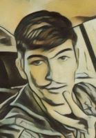

1. First and last name\
Reshetniak Maksim\

2. Contacts for communication\
Discord - <https://discordapp.com/users/319151035245395979/>
3. Brief information about myrself\
Six months ago, I began to study front-end technologies. Perseverance and desire help me deal with new knowledge in this area.
4. Skills (programming languages, frameworks, methodologies, version control systems and development tools)\
- HTML
- CSS  tried it in practice: scss(basic functionality of preprocessors), positioning(flexbox), three column layout, adaptive design.
- JS (basic knowledge). And also solved problems on leetcode <https://github.com/MaksimR02/training_algorithm>.
- Git basic commands.
5. Code example\
```
function spinWords(string) {
  const words = string.split(" ");
  const resultWords = words.map((word) => {
    if (word.length >= 5) {
      return word.split("").reverse().join("");
    }
    return word;
  });
  return resultWords.join(" ");
}
```
6. Experience.\
I am currently working on a project <https://github.com/MaksimR02/stage-1-rs-school>
7. Education\
I am currently taking a course in programming from RS School
8. English language\
English language level B1